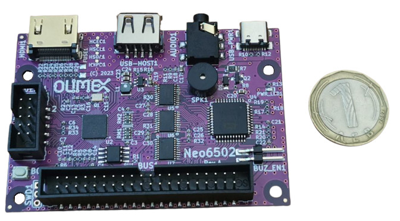

# Neo6502
Neo6502 Modern Retro Computer with W65C02S processor and RP2040 memory and peripherals emulator

Neo6502 is small board with dimensions 80x55mm.

it consist of real W65C02S processor and RP2040 which emulates RAM memory, video, keyboard, SPI, I2C, UART, GPIOs, Sound

## Intro

W65C02S lives in The Matrix and thinks there is real RAM and other interfaces around it, but the truth is that all this is emulation of the real life. The RP2040 emulates the RAM memory, video, IO and even clock the W65C02S by PWM.

## Features

Neo6502 has these features:

* W65C02S processor
* RP2040 SOC with 2MB Flash
* DVI video on HDMI connector
* USB host for keyboard
* Audio 3.5mm output
* Speaker with enable jumper
* USB-C for power supply
* UEXT connector with I2C, UART and SPI
* 40 pin 6502 bus connector with all W65C02 signals
* Dimensions 80x55mm
* 4 mount holes

## Licenses

* Hardware is released under CERN Open Hardware Licence Version 2 - Strongly Reciprocal, all silkscreen credits to Olimex should remain;
* Software is released under GPL3 Licensee
* Documentation is released under CC BY-SA 3.0